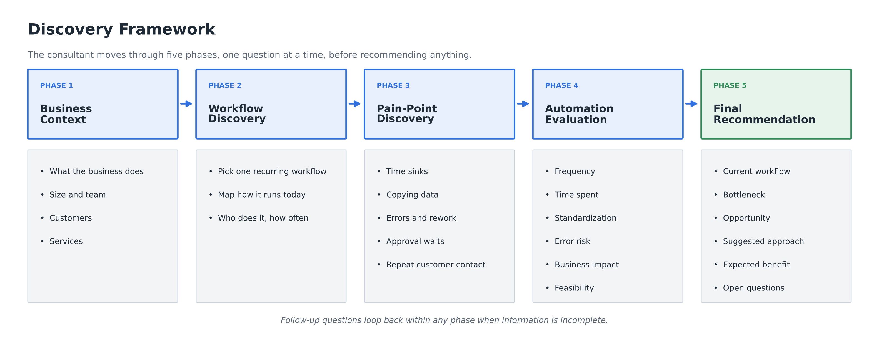
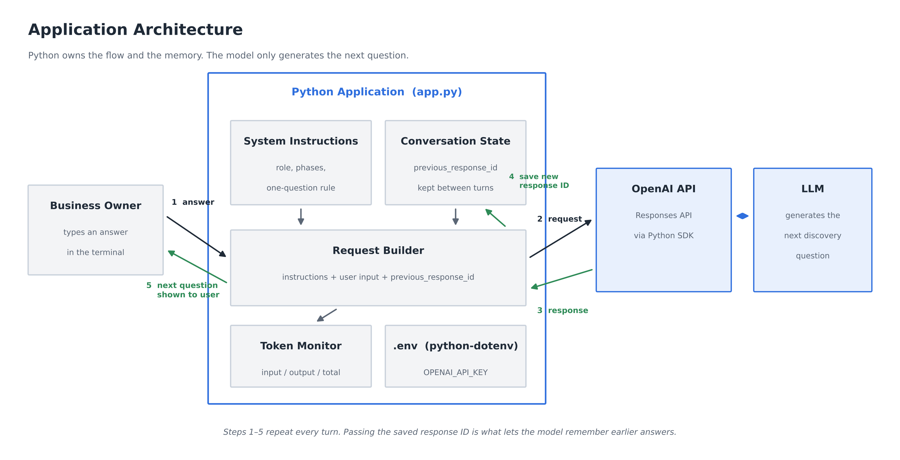
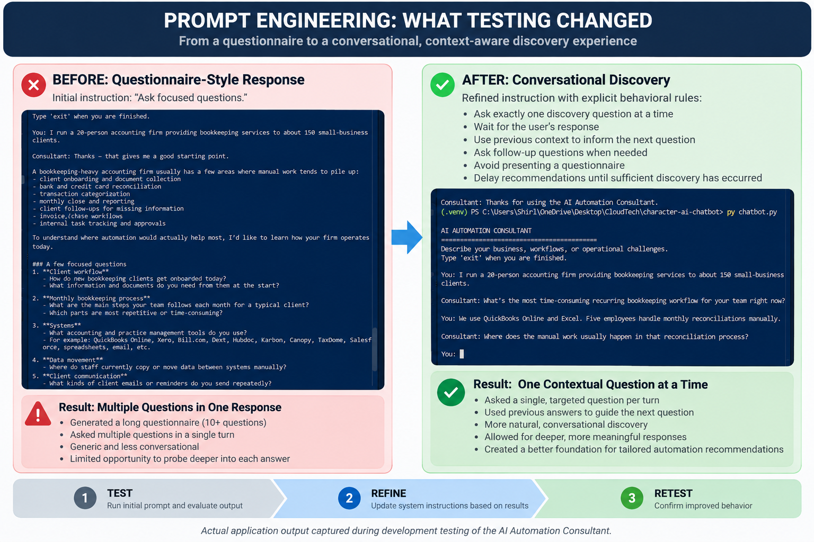

# AI Automation Consultant

A conversational LLM application built with Python and the OpenAI API that helps small and mid-sized businesses identify potential workflow automation opportunities through structured operational discovery.

## For Recruiters and Hiring Managers

Many businesses know that AI and automation could improve their operations. The harder question is often: What should we automate first?

I built the AI Automation Consultant to explore that problem.

Rather than immediately generating generic automation recommendations, the application conducts structured discovery. It asks one question at a time, maintains conversational context, and uses previous answers to determine what it should investigate next.

The project demonstrates practical experience with Python, OpenAI API integration, prompt engineering, multi-turn conversation state, behavioral testing, secure credential management, and token monitoring.

---

## Business Problem

Businesses may have dozens of processes that appear to be candidates for automation.

Before selecting technology, it is useful to understand:

- Where employees spend significant manual effort
- Which workflows happen repeatedly
- Where information moves manually between systems
- Which processes create errors, delays, or rework
- Which workflows are standardized
- Where automation could create meaningful business value

Automating the wrong process can simply make an inefficient workflow run faster.

This application begins with operational discovery instead.

---

## Solution

The AI Automation Consultant conducts an interactive discovery conversation designed to move from understanding the business to evaluating a potential automation opportunity.



Instead of presenting a long questionnaire, the consultant asks one focused question, waits for the answer, and uses that information to determine the next question.

---

## Example Interaction

```text
AI AUTOMATION CONSULTANT
========================================
Describe your business, workflows, or operational challenges.
Type 'exit' when you are finished.

You:
I run a 20-person accounting firm providing bookkeeping
services to about 150 small-business clients.

Consultant:
What's the most time-consuming recurring bookkeeping workflow
for your team right now?

You:
We use QuickBooks Online and Excel. Five employees handle
monthly reconciliations manually.

Consultant:
Where does the manual work usually happen in that
reconciliation process?
```

The follow-up question is informed by information collected earlier in the conversation rather than selected from a static questionnaire.

---

## Discovery Framework

The consultant follows five stages.

### Phase 1 — Business Context

Understand:

- What the business does
- Approximate size and team
- Customers
- Services provided

### Phase 2 — Workflow Discovery

Identify one important repetitive workflow and understand:

- How it currently operates
- Who performs the work
- How frequently it occurs

### Phase 3 — Pain-Point Discovery

Investigate areas such as:

- Time-consuming activities
- Manual data movement
- Errors and rework
- Approval delays
- Repetitive customer communication

### Phase 4 — Automation Evaluation

Potential opportunities are considered across:

- Frequency
- Time spent
- Manual effort
- Standardization
- Error risk
- Business impact
- Automation feasibility

In the current version, this evaluation is qualitative and performed through the LLM's reasoning. A deterministic scoring model is intentionally reserved for a future version.

### Phase 5 — Recommendation

Once sufficient discovery has occurred, the consultant is instructed to explain:

- Current workflow
- Problem or bottleneck
- Automation opportunity
- Suggested approach
- Expected business benefit
- Information still needed

---

## Application Architecture

Python manages the application flow and conversation state. The model generates context-aware discovery questions based on the supplied instructions and conversation context.



The application sends three important pieces of information during the conversation:

1. Consultant system instructions
2. Current user input
3. Previous response ID

The returned response ID is saved and supplied with the next request, allowing the conversation to maintain context across turns.

---

## Prompt Engineering and Testing

## Prompt Engineering and Testing

One of the most important findings during development was that defining an AI role was not enough to produce the desired interaction.

During initial testing, the instruction to "ask focused questions" produced a questionnaire-style response containing multiple discovery questions in a single turn.

Rather than treating this as an API failure, I treated it as an LLM behavioral problem.

I refined the system instructions to require the consultant to:

- Ask exactly one discovery question at a time
- Wait for the user's response
- Build the next question from previous answers
- Ask follow-up questions when information is incomplete
- Avoid presenting a questionnaire
- Delay recommendations until sufficient discovery has occurred



### Behavioral Tests

Development included direct behavioral tests rather than evaluating responses only by whether the API call succeeded.

| Test | Initial Behavior | Change | Result |
| --- | --- | --- | --- |
| Conversation context | Consultant could not recall an earlier staffing detail | Added response-ID chaining | Consultant correctly recalled that five employees handled reconciliations |
| Discovery flow | Consultant returned multiple questions in one response | Added explicit one-question-at-a-time rules | Consultant produced a single contextual follow-up question |
| Token visibility | API consumption was not visible in the application | Added response usage reporting | Input, output, and total token counts are displayed after each response |

These tests influenced both the application logic and the system instructions.

---

## LLM Engineering Concepts Demonstrated

### OpenAI API Integration

The application uses the OpenAI Python SDK and Responses API to programmatically send user input to an OpenAI model and retrieve generated responses.

### System Instruction Design

The instruction layer establishes:

- Consultant role
- Discovery methodology
- Conversational behavior
- Evaluation criteria
- Recommendation rules

This allows the application to control behavior beyond an individual user prompt.

### Multi-Turn Conversation State

The application maintains context by storing:

```python
previous_response_id
```

After each API response:

```python
previous_response_id = response.id
```

The stored response ID is then supplied with the next request.

This allows later turns to build on information supplied earlier in the conversation.

### Token Monitoring

The application displays:

- Input tokens
- Output tokens
- Total tokens

For one test request, the application reported:

```text
Input tokens: 449
Output tokens: 36
Total tokens: 485
```

This made the relationship between system instructions, conversation context, generated output, and API usage visible during development.

### Secure Configuration

The OpenAI API key is loaded from an environment variable using `python-dotenv`.

The real `.env` file is excluded from version control.

An `.env.example` file documents the required configuration without exposing credentials.

---

## Technology Stack

- Python
- OpenAI Responses API
- OpenAI Python SDK
- python-dotenv
- Git
- GitHub
- Visual Studio Code

Model used during development:

```text
gpt-5.4-mini
```

---

## Project Structure

```text
ai-automation-consultant/
│
├── docs/
│   └── images/
│       ├── application-architecture.png
│       ├── discovery-framework.png
│       └── prompt-iteration.png
│
├── .env.example
├── .gitignore
├── app.py
├── README.md
└── requirements.txt
```

Local development also uses:

```text
.env
.venv/
```

These should not be committed to the repository.

---

## Running the Application

### 1. Clone the repository

```bash
git clone <repository-url>
cd ai-automation-consultant
```

### 2. Create a virtual environment

```bash
python -m venv .venv
```

### 3. Activate the virtual environment

Windows PowerShell:

```powershell
.\.venv\Scripts\Activate.ps1
```

macOS/Linux:

```bash
source .venv/bin/activate
```

### 4. Install dependencies

```bash
python -m pip install -r requirements.txt
```

### 5. Configure the API key

Copy:

```text
.env.example
```

to:

```text
.env
```

Then add your OpenAI API key:

```text
OPENAI_API_KEY=your_openai_api_key_here
```

### 6. Run the application

```bash
python app.py
```

---

## Current Limitations

This version intentionally focuses on the core LLM interaction and discovery workflow.

Current limitations include:

- Command-line interface only
- Conversation state exists only during the running session
- No persistent database or user account
- No deterministic automation opportunity score
- No structured assessment output
- No external business-system integrations
- Recommendations have not been validated as part of a production consulting engagement

The application should therefore be viewed as an LLM application prototype rather than a production automation assessment platform.

---

## Engineering Lessons

### LLM behavior needs explicit constraints

Assigning a model a role does not fully define how it should behave.

Interaction rules matter.

The difference between:

```text
Ask focused questions.
```

and:

```text
Ask exactly ONE discovery question at a time.
Wait for the user's response before asking another question.
```

produced a meaningful change in the user experience.

### Conversation state is part of application design

The initial interactive application sent only the current user input.

When asked about information from an earlier turn, the consultant responded that the information had not been provided.

Adding response-ID chaining allowed the application to maintain conversational context.

### Testing LLM applications includes testing behavior

A successful API response does not necessarily mean the application is behaving correctly.

Testing included questions such as:

- Did the model remember information?
- Did it ask the correct number of questions?
- Did the next question use previous context?
- Was API usage visible?

### LLM applications combine AI behavior with traditional software logic

The model handles natural-language reasoning and generation.

Python handles:

- Application flow
- User input
- API communication
- Conversation state
- Environment configuration
- Usage reporting

The application depends on both.

---

## Future Enhancements

Potential future iterations include:

- Deterministic Automation Opportunity Score
- Structured JSON assessment output
- Generated automation assessment reports
- Web-based interface
- Persistent consultation sessions
- Database integration
- Tool calling
- Retrieval-Augmented Generation
- Workflow automation integrations
- Cloud deployment

The current version intentionally stops before these features so the core conversational discovery architecture can remain clear and testable.
